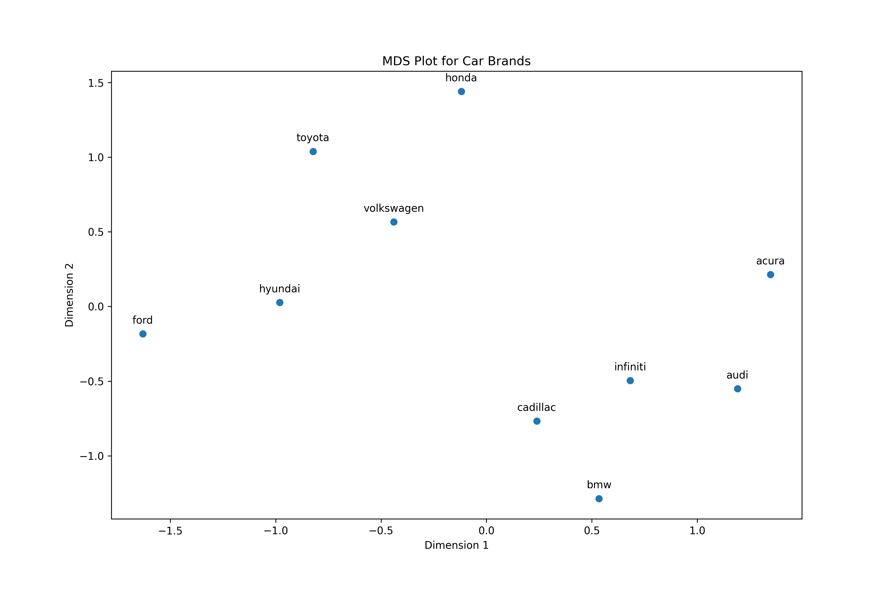

# Reshaping Luxury Car Strategies with Consumer Insights

## Table of Contents
1. [Description](#1-description)
2. [Research Questions](#2-questions)
3. [Project Overview](#3-overview)
4. [Data Resources](#4-data)
5. [Conclusions and Insights](#5-conclusions)

---

## 1. Description 
In this project, we analyzed discussions from the Entry-Level Luxury Car Forum. Utilizing data scraping and Lift Analysis techniques, we discerned prevalent brand comparisons and the attributes being discussed. Furthermore, we evaluated consumer aspirations by analyzing brand mentions associated with aspiration-indicative words.

---

## 2. Research Questions
### Task 0:
1. Develop a Python scraper to retrieve messages from Edmunds.com discussion forums. The output should be a .csv file containing columns: date and message. Study the forum's HTML structure and threading patterns before creating the scraper.
2. Extract approximately 5000 car-related posts from the [Entry Level Luxury forum](https://forums.edmunds.com/discussion/2864/general/x/entry-level-luxury-performance-sedans).

### Task A:
- Test the data's adherence to Zipf’s law econometrically and plot the 100 most common words against the law's theoretical prediction. Do not remove stopwords or perform stemming/lemmatization.

### Task B:
- Identify the top 10 brands from frequency counts. Create a script to count word frequencies (excluding stopwords) and replace common car models with brand names.

### Task C:
- Calculate lift ratios for associations between the top-10 brands from Task A. Develop a script for this task, ensuring a message is not counted more than once per post.

### Task D:
- Illustrate the brands on a multi-dimensional scaling (MDS) map using a Python script.

### Task E:
- Offer insights to your client based on analyses in Tasks C and D.

### Task F:
- Identify the 5 most frequently mentioned car attributes or features in the discussions and their strong associations with the top 5 brands.

### Task G:
- Provide strategic advice to your client based on findings from Task F.

### Task H:
- Determine the most aspirational brand in your data and discuss the business implications for this brand.

---

## 3. Project Overview
During the initial phase of the project, we focused on gathering substantial data from the Entry-Level Luxury Car Forum. This data served as a rich resource for understanding consumer preferences and discussions revolving around various car brands and their attributes.

In Task B, we conducted a frequency analysis to identify the top mentioned brands and common terms in the discussions. The analysis revealed the following brands as the most frequently mentioned:

- BMW: 2003 mentions
- Audi: 1467 mentions
- Acura: 1312 mentions
- Honda: 949 mentions
- Seat: 594 mentions
- Volkswagen: 469 mentions
- Sedan: 424 mentions
- Infiniti: 395 mentions
- Cadillac: 379 mentions
- Hyundai: 358 mentions
- Toyota: 345 mentions
- Problem: 309 mentions
- Ford: 275 mentions

Following Task B, in Task C, we utilized the data to calculate lift ratios between the top-mentioned brands. This involved creating a heatmap visualization that clearly displayed the lift scores between these brands, providing a graphical representation of the associations and relationships between them. Here is the heatmap visualization:

In Task D, we further analyzed the data through a multi-dimensional scaling (MDS) plot, which showcased two distinct clusters: luxury and non-luxury car brands. This visualization helped in delineating the perceptual differences between the brands, offering a clear picture of the market dynamics and consumer preferences. Here is the MDS plot:

#### Insights

| Analysis Type        | Insight Category           | Description  |
|----------------------|----------------------------|--------------|
| MDS Coordinates      | Cluster of Luxury Brands   | Brands like 'bmw', 'audi', and 'infiniti' are grouped closely together, suggesting they are perceived similarly, likely as luxury or high-end brands. |
|                      | Mainstream vs. Luxury      | 'honda' and 'toyota' are distanced from luxury brands like 'bmw', indicating a differentiation in the market perception between mainstream and luxury brands. |
|                      | Isolated Brands            | 'ford' and 'honda' appear as outliers, suggesting they are unique in certain aspects compared to other brands. |
| Lift Values          | Affinity Between Luxury Brands | High lift values for combinations like ('audi', 'infiniti') and ('bmw', 'audi') show that these luxury brands often appear together, suggesting a strong affinity among consumers for these brands. |
|                      | Mainstream Affinities      | High lift values between ('honda', 'toyota') and ('hyundai', 'toyota') suggest that these mainstream brands share a lot of similarities in consumer perception. |
|                      | Mixed Affinities           | Brands like 'audi' and 'volkswagen' have a significant lift value, indicating that consumers often consider these brands together, despite one being a luxury brand and the other more mainstream. |
| Integrated Insights  | Cross-Segment Appeal       | 'audi' seems to have a broader appeal, as indicated by high lift values with both luxury ('bmw', 'infiniti') and non-luxury ('volkswagen') brands. This could be a unique selling proposition. |
|                      | Potential Partnerships     | High lift values between brands like ('audi', 'infiniti') and ('honda', 'toyota') could imply beneficial partnerships or co-branding opportunities. |
|                      | Targeting Strategy         | If the client is, for example, 'audi', they could focus marketing strategies on consumers who also show interest in 'bmw' or 'infiniti' given their close proximity in the MDS plot and high lift values. |
|                      | Competitive Positioning    | Brands like 'ford' that are isolated in the MDS plot but have lower lift values with other brands may need to re-evaluate their market positioning. |

#### Relevancy with Market Perception

| Analysis Type        | Insight Category           | Relevancy with Current Real-World Market Perception  |
|----------------------|----------------------------|------------------------------------------------------|
| MDS Coordinates      | Luxury Cluster             | Brands like BMW, Audi, and Infiniti are generally considered luxury brands. Their close proximity in the MDS plot aligns well with market perceptions. |
|                      | Mainstream Brands          | Honda and Toyota are perceived as mainstream and reliable brands. Their distinct positioning in the MDS plot is consistent with this perception. |
|                      | Isolated Brands            | Ford has a diverse product line ranging from trucks to sedans to electric vehicles. Its unique positioning in the MDS plot could reflect this diversity. |
| Lift Values          | High Affinity Among Luxury Brands | High lift values among Audi, BMW, and Infiniti suggest that consumers interested in one luxury brand are likely to consider others. This aligns with the general perception that these brands compete in the same luxury market segment. |
|                      | Mainstream Affinities      | High lift values for Honda-Toyota and Hyundai-Toyota pairs are consistent with the market segment that values reliability and cost-effectiveness. These brands are often compared and considered together by consumers. |
|                      | Cross-Segment Appeal       | Audi has high lift values with both luxury (BMW, Infiniti) and mainstream (Volkswagen) brands. This may reflect Audi's broader market appeal and is consistent with its positioning as a luxury brand that offers some more accessible models. |
| Integrated Insights  | Partnerships and Co-branding | The high lift values among certain brand pairs suggest potential for partnerships or co-branding opportunities. This is not uncommon in the automotive industry where technology and platforms are often shared. |
|                      | Competitive Positioning    | Ford's unique positioning could be both an opportunity and a challenge. The brand has been investing in electric and autonomous vehicles, which could explain its distinct market perception and offer avenues for differentiation. |

---

## 4. Data Resources
The following data files are essential for the analysis:
- DiscussionData.csv
- car_models_and_brands.csv

---

## 5. Conclusions and Insights
The data analysis reveals a distinct separation between luxury and mainstream brands. Luxury brands predominantly excel in aspects like aspiration and sportiness, whereas mainstream brands have a broader attribute spectrum. This presents an opportunity for brands to accentuate their strengths and address weaknesses. For instance, Cadillac could enhance their engine quality perception, while Audi could strategize to reach a wider consumer base. Brands might also consider forming partnerships based on high lift values to explore complementary market segments.
